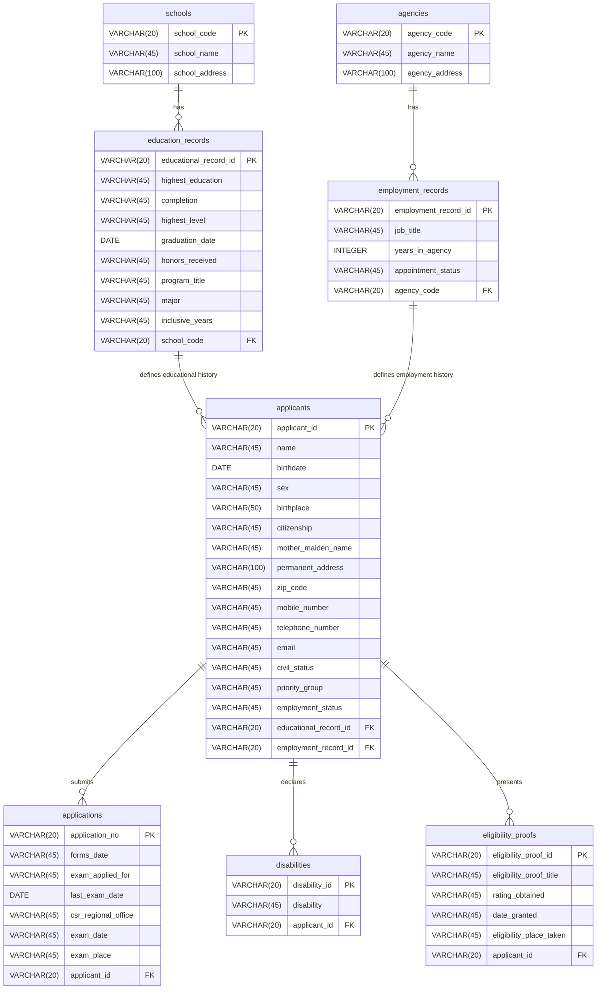

# Database Schema - PostgreSQL (Supabase) Adaptation

This document details the PostgreSQL schema mapped from the original MySQL source (`DATABASESCHEMA.sql`). All table structures, foreign keys, and fields are preserved and adapted for PostgreSQL compatibility.

## 1. Schema Diagram Overview



---

## 2. Table Definitions (PostgreSQL DDL)

Below is the DDL to create the schema in Supabase (PostgreSQL).

```sql
-- Disable triggers/checks temporarily for bulk setup if needed
-- SET session_replication_role = 'replica';

-- 1. Create schools Table
CREATE TABLE IF NOT EXISTS schools (
    school_code VARCHAR(20) PRIMARY KEY,
    school_name VARCHAR(45) NOT NULL,
    school_address VARCHAR(100) NOT NULL
);

-- 2. Create agencies Table
CREATE TABLE IF NOT EXISTS agencies (
    agency_code VARCHAR(20) PRIMARY KEY,
    agency_name VARCHAR(45) NOT NULL,
    agency_address VARCHAR(100) NOT NULL
);

-- 3. Create education_records Table
CREATE TABLE IF NOT EXISTS education_records (
    educational_record_id VARCHAR(20) PRIMARY KEY,
    highest_education VARCHAR(45) NOT NULL,
    completion VARCHAR(45) NOT NULL,
    highest_level VARCHAR(45) DEFAULT NULL,
    graduation_date DATE DEFAULT NULL,
    honors_received VARCHAR(45) DEFAULT NULL,
    program_title VARCHAR(45) NOT NULL,
    major VARCHAR(45) NOT NULL,
    inclusive_years VARCHAR(45) NOT NULL,
    school_code VARCHAR(20) NOT NULL REFERENCES schools(school_code) ON DELETE RESTRICT
);

-- 4. Create employment_records Table
CREATE TABLE IF NOT EXISTS employment_records (
    employment_record_id VARCHAR(20) PRIMARY KEY,
    job_title VARCHAR(45) NOT NULL,
    years_in_agency INTEGER NOT NULL,
    appointment_status VARCHAR(45) NOT NULL,
    agency_code VARCHAR(20) NOT NULL REFERENCES agencies(agency_code) ON DELETE RESTRICT
);

-- 5. Create applicants Table
CREATE TABLE IF NOT EXISTS applicants (
    applicant_id VARCHAR(20) PRIMARY KEY,
    name VARCHAR(45) NOT NULL,
    birthdate DATE NOT NULL,
    sex VARCHAR(45) NOT NULL,
    birthplace VARCHAR(50) NOT NULL,
    citizenship VARCHAR(45) NOT NULL,
    mother_maiden_name VARCHAR(45) NOT NULL,
    permanent_address VARCHAR(100) NOT NULL,
    zip_code VARCHAR(45) NOT NULL,
    mobile_number VARCHAR(45) NOT NULL,
    telephone_number VARCHAR(45) DEFAULT NULL,
    email VARCHAR(45) NOT NULL,
    civil_status VARCHAR(45) NOT NULL,
    priority_group VARCHAR(45) DEFAULT NULL,
    employment_status VARCHAR(45) NOT NULL,
    educational_record_id VARCHAR(20) NOT NULL REFERENCES education_records(educational_record_id) ON DELETE RESTRICT,
    employment_record_id VARCHAR(20) DEFAULT NULL REFERENCES employment_records(employment_record_id) ON DELETE SET NULL
);

-- 6. Create applications Table
CREATE TABLE IF NOT EXISTS applications (
    application_no VARCHAR(20) PRIMARY KEY,
    forms_date VARCHAR(45) NOT NULL,
    exam_applied_for VARCHAR(45) NOT NULL,
    last_exam_date DATE DEFAULT NULL,
    csr_regional_office VARCHAR(45) NOT NULL,
    exam_date VARCHAR(45) NOT NULL,
    exam_place VARCHAR(45) NOT NULL,
    applicant_id VARCHAR(20) NOT NULL REFERENCES applicants(applicant_id) ON DELETE CASCADE
);

-- 7. Create disabilities Table
CREATE TABLE IF NOT EXISTS disabilities (
    disability_id VARCHAR(20) PRIMARY KEY,
    disability VARCHAR(45) NOT NULL,
    applicant_id VARCHAR(20) NOT NULL REFERENCES applicants(applicant_id) ON DELETE CASCADE
);

-- 8. Create eligibility_proofs Table
CREATE TABLE IF NOT EXISTS eligibility_proofs (
    eligibility_proof_id VARCHAR(20) PRIMARY KEY,
    eligibility_proof_title VARCHAR(45) NOT NULL,
    rating_obtained VARCHAR(45) NOT NULL,
    date_granted VARCHAR(45) NOT NULL,
    eligibility_place_taken VARCHAR(45) NOT NULL,
    applicant_id VARCHAR(20) NOT NULL REFERENCES applicants(applicant_id) ON DELETE CASCADE
);

-- 9. Add Status Column to applications table (For application tracking status)
-- NOTE: We extend applications to have a status column to track progress as requested in PID.md.
ALTER TABLE applications ADD COLUMN IF NOT EXISTS status VARCHAR(20) DEFAULT 'Pending';

-- Reset replica mode
-- SET session_replication_role = 'origin';
```

---

## 3. Database Indexes

To optimize applicant lookups (by name, email) and status tracking searches:

```sql
CREATE INDEX IF NOT EXISTS idx_applicants_email ON applicants(email);
CREATE INDEX IF NOT EXISTS idx_applicants_name ON applicants(name);
CREATE INDEX IF NOT EXISTS idx_applications_applicant_id ON applications(applicant_id);
```
